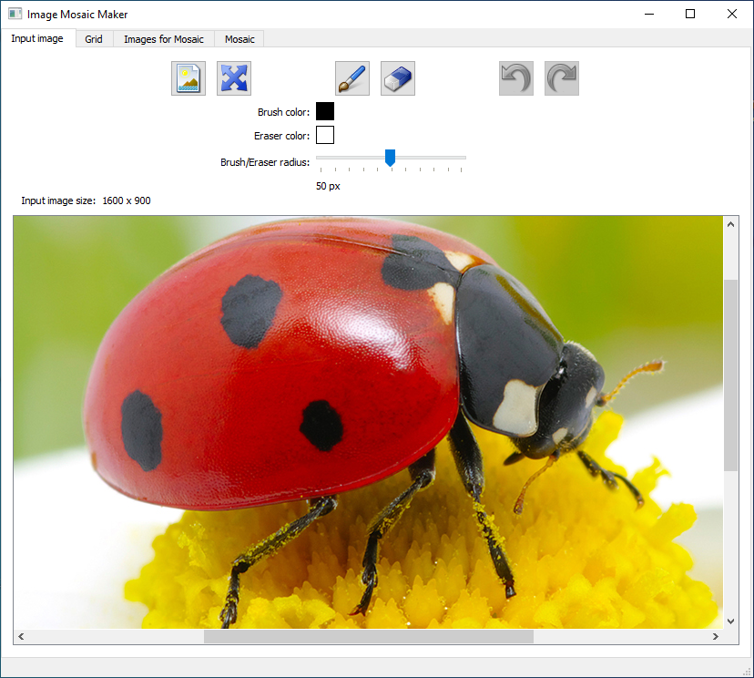
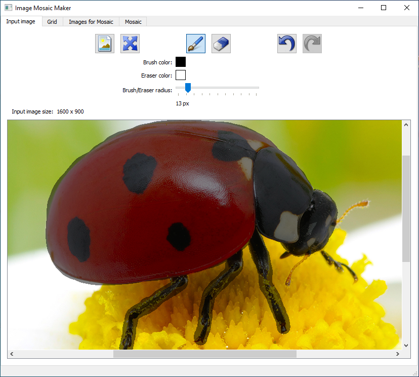
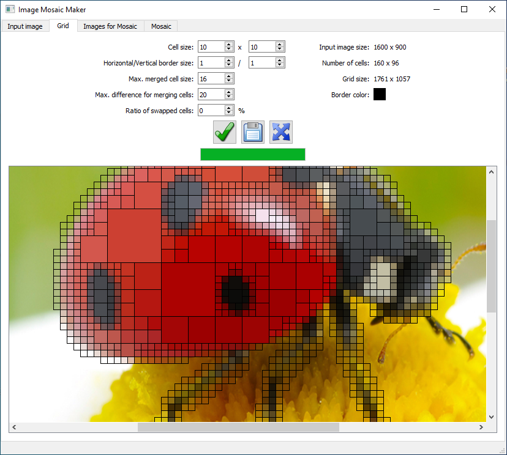
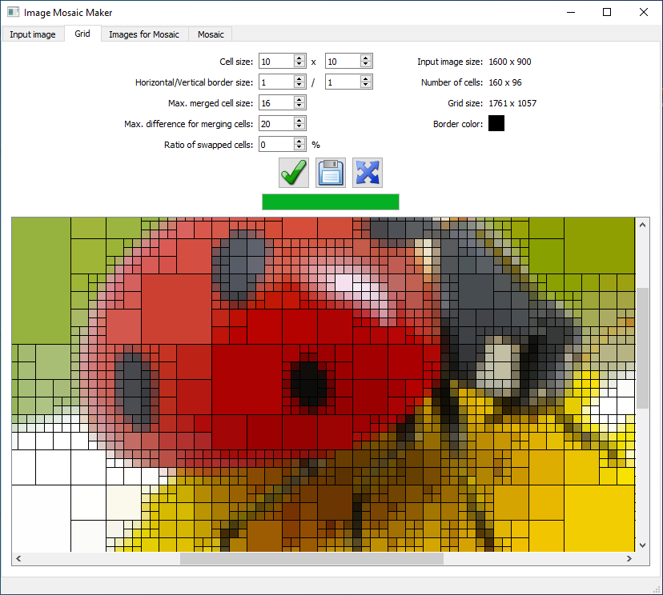
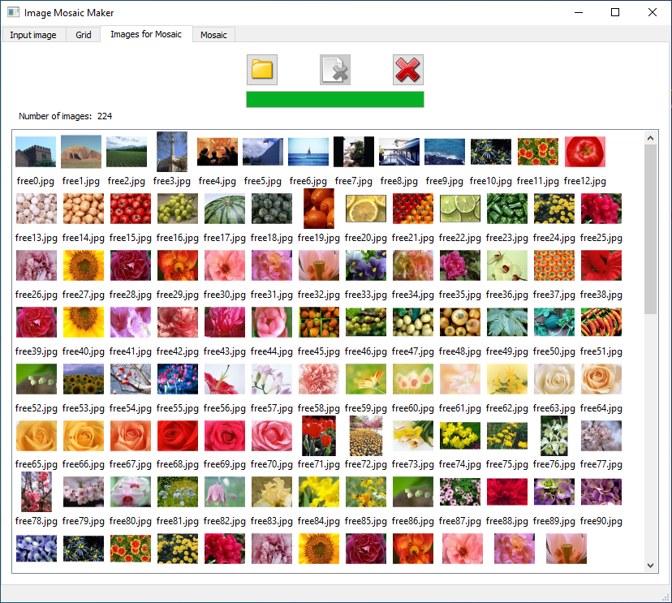
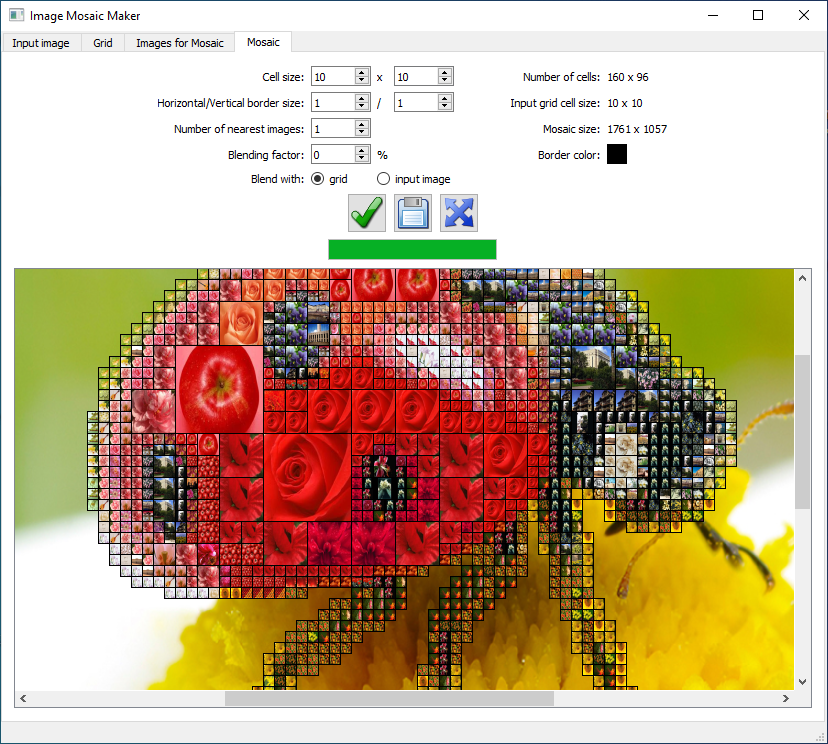
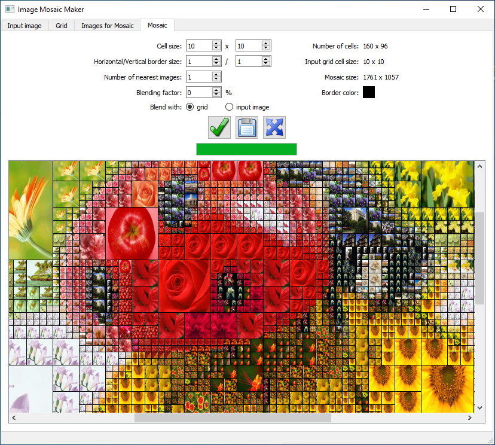
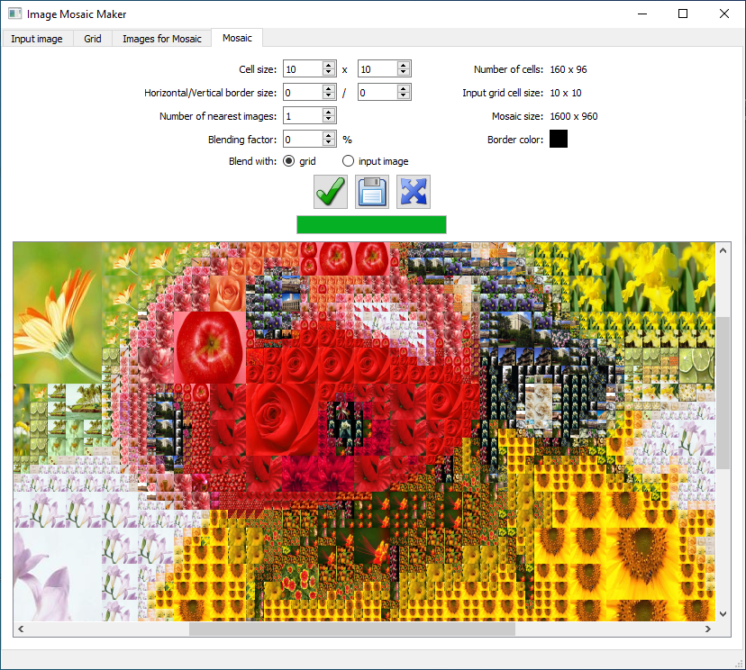
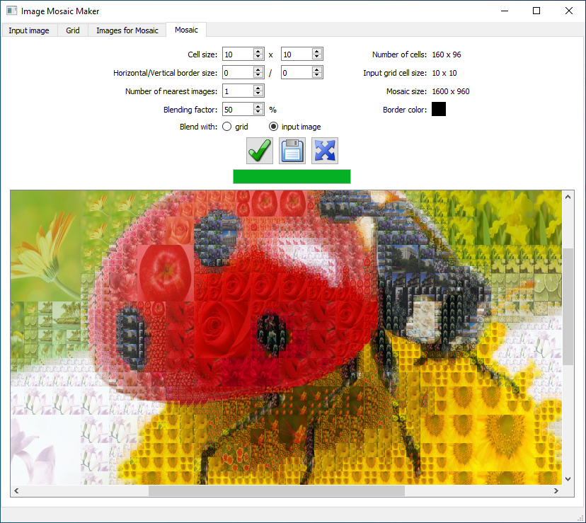

# Image Mosaic Maker

Application for creating mosaics out of a large number of small images which together resemble some other image. 

### External libraries:

- Qt5
- OpenCV

### Description:

It works in 4 stages: 

1. Load the input image:

Optionally indicate with a brush which portions of the input image will be replaced with a mosaic:

2. Generate a grid where each cell contains the mean color value of all pixels in the corresponding area of the input image. 
Neighboring cells with similar colors can be merged into larger cells depending on some settings:

You can choose what percentage of cells will have randomly switched colors:

3. Load a number of small images which are to be used for the final mosaic: 

4. Generate the final mosaic. 
Each grid cell from step 2 will be replaced with a small image from step 3. 
The small image will be randomly chosen from a given number of closest small images (in terms of their mean color):

Result without borders between cells:

The result can also be blended with mean colors in the grid or with the input image: 

